# PipSavings — Personal Finance & Budgeting

> **Know your money. Without typing it in, without anyone else seeing it.**

PipSavings (“Pip”) is a privacy-first, local-first personal finance and budgeting application built with Expo (React Native), TypeScript, and SQLite. Capture from receipts and e-wallet screenshots, then budget, track net worth, split bills, and follow Malaysian tax relief. Home can also switch to **Ask Pip**: a bring-your-own-key chat that opens the real screens instead of inventing answers.

---

## Screenshots

<table>
  <tr>
    <td align="center" valign="top" width="50%">
      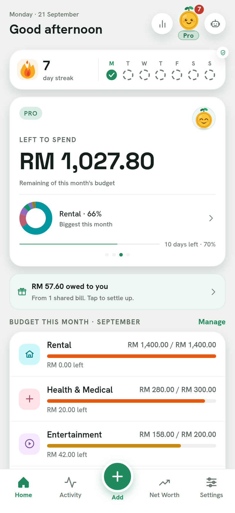
      <p><strong>Home</strong><br />This month’s leftover budget, logging streak, and category envelopes. The robot icon switches Home to Ask Pip. The raised + is capture.</p>
    </td>
    <td align="center" valign="top" width="50%">
      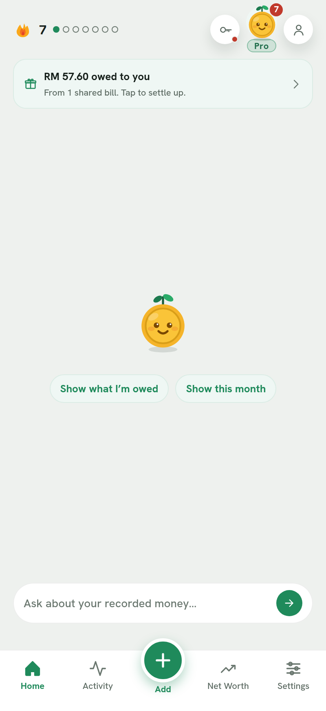
      <p><strong>Ask Pip</strong><br />Bring-your-own-key chat on Home. Paste a Groq, Gemini, or OpenRouter key, then type or tap a chip. Pip opens the real screen instead of writing a summary.</p>
    </td>
  </tr>
  <tr>
    <td align="center" valign="top" width="50%">
      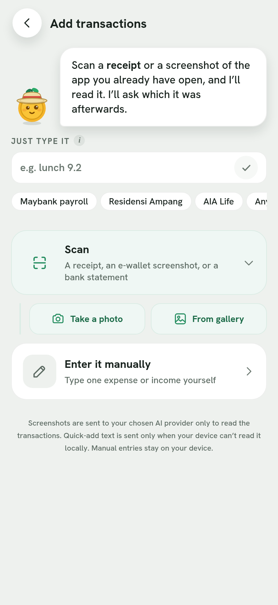
      <p><strong>Add</strong><br />Scan a receipt or an e-wallet screenshot, type a quick add like “lunch 9.2”, or enter a row by hand. Vision uses your key when one is saved.</p>
    </td>
    <td align="center" valign="top" width="50%">
      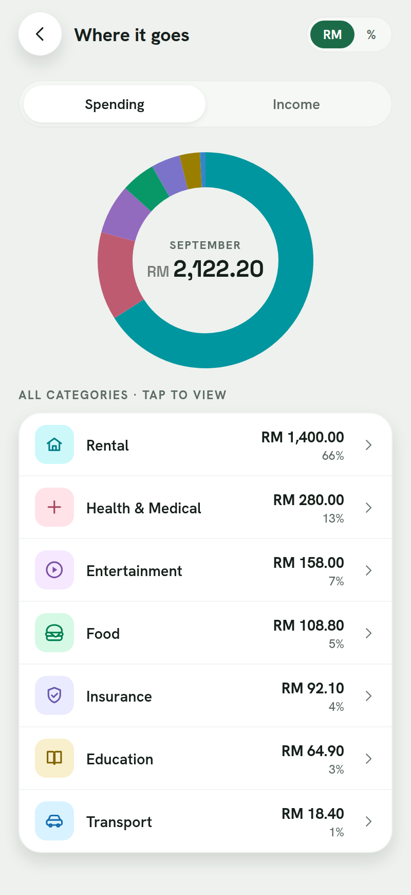
      <p><strong>Where it goes</strong><br />Spending by category for the month. Tap a row to see the transactions inside it.</p>
    </td>
  </tr>
  <tr>
    <td align="center" valign="top" width="50%">
      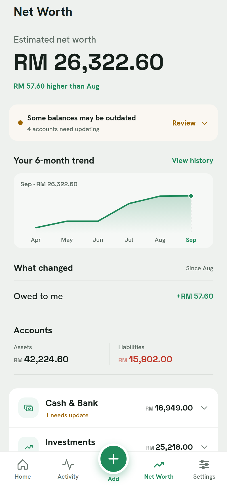
      <p><strong>Net worth</strong><br />Assets minus liabilities, with a six-month curve. Cash, investments, what people owe you, and loans live in one list. Holdings can refresh against live prices.</p>
    </td>
    <td align="center" valign="top" width="50%">
      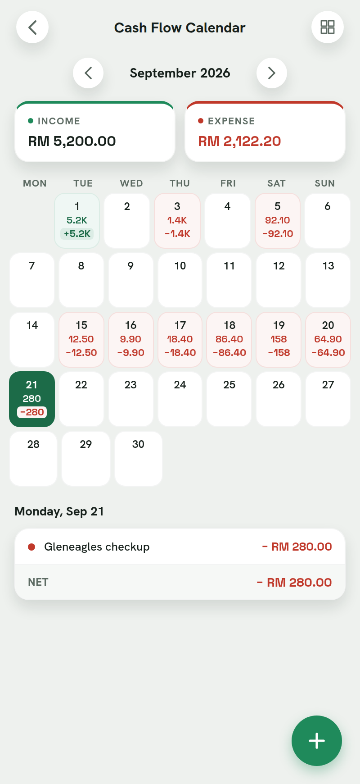
      <p><strong>Cash flow calendar</strong><br />Income and spend day by day. Green days net in; red days net out. Tap a date to see what hit.</p>
    </td>
  </tr>
  <tr>
    <td align="center" valign="top" width="50%">
      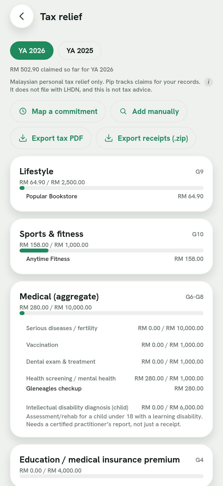
      <p><strong>Tax relief</strong><br />LHDN relief categories with their annual caps. Tag eligible spend as you go (lifestyle, sports, medical, and the rest) instead of hunting receipts at filing time.</p>
    </td>
    <td align="center" valign="top" width="50%">
      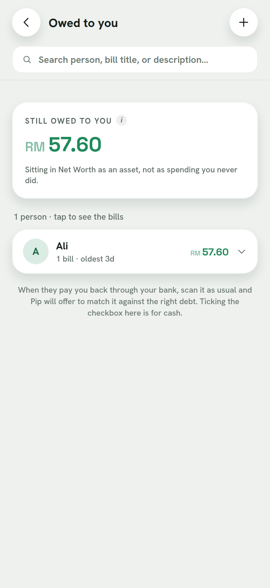
      <p><strong>Owed</strong><br />Who still owes you after a split bill. That balance sits in net worth as an asset, not as spending you never did. Scan a repayment to match it, or tick cash.</p>
    </td>
  </tr>
  <tr>
    <td align="center" valign="top" width="50%">
      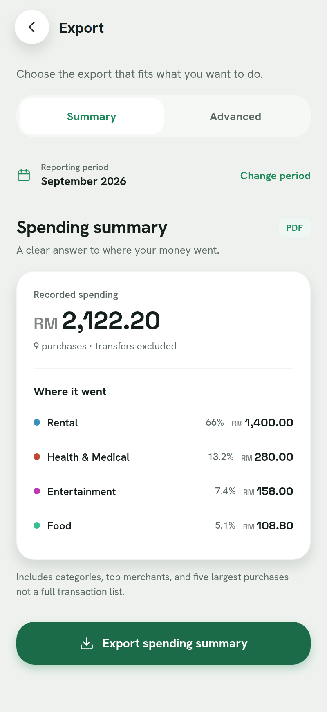
      <p><strong>Export</strong><br />A spending-summary PDF for the month, or Advanced for full PDF statements, Excel, HTML, CSV, and a re-importable JSON backup.</p>
    </td>
    <td></td>
  </tr>
</table>

---

## How the app flows

Dashboard is the default Home. The bottom bar is always Home, Activity, **+ Add**, Net Worth, and Settings. The robot icon on Home switches that tab to Ask Pip; the rest of the app stays put.

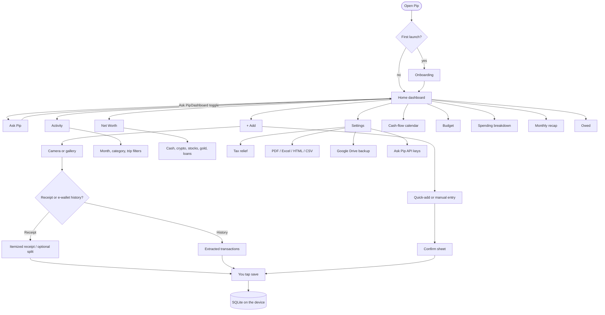

### Ask Pip (BYOK)

Ask Pip is optional. No key, and chat still opens; sending a message brings up the key sheet. The key is stored in SecureStore on native (local storage on web). It is never written to the backup zip, never sent to Pip’s Cloudflare scan proxy, and never mixed with founder env keys.

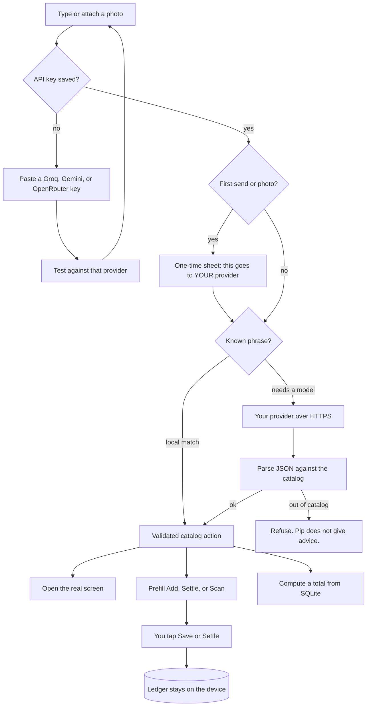

Chat interprets and prepares. It does not create, edit, settle, or delete records. Totals you see are app-calculated from the local ledger, not numbers the model made up.

---

## Key Features

### 1. Ask Pip: BYOK chat on Home
- **Toggle, not a replacement**: Home stays the dashboard until you tap Ask Pip. The choice persists. Other tabs are unchanged.
- **Bring your own key**: Paste a Groq (`gsk_`), Gemini (`AIza`), or OpenRouter (`sk-or-`) key in Settings → API keys. Pip detects the provider from the prefix, tests it, and keeps it off the backup.
- **Opens real screens**: “Who owes me”, “this month”, a trip name, holdings, tax, export. The existing screen mounts in the chat canvas (or as a full destination for calendar / owed). Follow-ups tighten filters; they do not invent a second UI.
- **Prefill, then you confirm**: “Lunch 12” opens the confirm sheet filled in. “Settle Ali” opens the settle sheet for a resolved share. Attach a photo and vision runs on *your* key, without decrementing the free scan quota.
- **Closed catalog**: Advice, market calls, and “why am I broke” are refused. Ambiguous names (two Singapore trips, two Alis) become choice chips instead of a guess.
- **Privacy exception**: The first send and the first photo each get a one-time sheet. Prompts and attached images go directly to the provider behind the key you pasted. The ledger stays on the phone. See the [Privacy Policy](docs/privacy-policy.md).

### 2. Instant AI Capture & Merchant Memory
- **Screenshot Ingestion**: Take a screenshot of your Maybank MAE, Touch 'n Go eWallet, GrabPay, or bank statements. Pip's vision pipeline (Groq / Gemini / Ollama) extracts line items, dates, and amounts in seconds.
- **Physical Receipt Scanning**: Snap photos of paper receipts with auto-crop and edge detection using the document scanner.
- **Adaptive Merchant Memory**: Pip learns your categorization habits. When it encounters a known merchant again, it pre-fills the category automatically without prompting.
- **BYOK scans**: If an Ask Pip key is saved, Add-hub scans can use that key locally and skip the shared-proxy quota. Without a key, production scans go through the Cloudflare proxy and count against Free/Pro allowance.

### 3. Smart Budgeting & Category Envelopes
- **Flexible Category Envelopes**: Set target monthly budgets across essential and lifestyle categories.
- **Monthly Budget Wizard**: Guided setup to plan income baselines, fixed commitments, and discretionary allowances.

### 4. Net Worth & Multi-Asset Tracking
- **Assets & Liabilities**: Track bank accounts, cash, investments, real estate, and crypto alongside credit card balances, mortgages, and loans.
- **Live Market Prices**: Real-time price tracking for major cryptocurrencies (BTC, ETH, SOL, etc.) and commodities (gold/XAU).
- **Historical Net Worth Curve**: Monthly trend analysis tracking your overall financial trajectory.

### 5. Multi-Currency Support & Live FX
- **Global Currencies**: Full support for MYR, USD, SGD, EUR, GBP, JPY, AUD, CAD, HKD, IDR, THB, and more.
- **Real-Time FX Conversion**: Automatic exchange rate lookup and multi-currency normalization to your base currency.

### 6. Tax Relief Receipt Tracking
- **Tax Relief Categories**: Tag eligible expenses to relief categories (medical, lifestyle, sports equipment, parental care, education, childcare, SOCSO, EPF/PRS).
- **Sub-Cap & Ceiling Validation**: Automatically monitors aggregate and nested caps (e.g. lifestyle RM2,500 + sports RM1,000, medical RM10,000).
- **Tax Evidence Archive**: Attach and store digital receipt photos for audit readiness and export dedicated tax relief summaries.

### 7. Bill Splitting & Receivables (Owed)
- **Itemized Bill Splitting**: Split group restaurant bills with accurate service charge (10%), SST (6%/8%), rounding, and discount/voucher distribution.
- **Owed Dashboard**: Real-time tracking of who owes you money and what you owe others, with one-tap settlement and direct payment recording.

### 8. Recurring Commitments & DCA
- **Bills & Subscriptions**: Track fixed recurring commitments (rent, utilities, insurance, loan installments, telco).
- **Dollar-Cost Averaging (DCA)**: Schedule recurring investment contributions that automatically update holding quantities and cost basis.

### 9. Financial Reports & Export
- **Export Formats**: Generate PDF financial statements, structured Excel (`.xlsx`) workbooks, CSV ledgers, interactive HTML reports, and full JSON backups.
- **Advanced Import**: Ingest existing transactions, accounts, commitments, and historical data via CSV/Excel/JSON with deduplication.

### 10. Habit Loop & Gamification
- **Logging Streaks**: Daily logging streak counter with weekly activity rings.
- **Coin Mascot (Pip)**: Interactive mascot offering witty, passive-aggressive, and motivating commentary on milestones and spending habits.
- **Android Home Screen Widget**: At-a-glance streak and activity tracking right from your phone's home screen.

### 11. Privacy & Security
- **Local-first ledger**: All transactions, accounts, budgets, and saved receipts live in a SQLite database on the device (`expo-sqlite`). The database is not encrypted at rest.
- **No Accounts Required**: No signup and no bank login. Optional Google Drive backup uses your own Drive appData folder.
- **What can leave the device**: optional AI scans (Cloudflare + vision models, or your own key), Ask Pip prompts/images (your provider only), Play/RevenueCat subscription checks, Yahoo price/FX quotes, and crash reports. Crash diagnostics is **on by default** in production builds; turn it off in **Settings → Data → Crash Diagnostics**. Bug reports leave only if you tap Send. See [`src/lib/diagnostics.ts`](src/lib/diagnostics.ts) and [`src/lib/diagnosticsScrub.ts`](src/lib/diagnosticsScrub.ts).

---

## Tech Stack & Architecture

- **Framework**: [Expo](https://expo.dev/) (SDK 54) / [React Native](https://reactnative.dev/) (0.81) / React 19
- **Language**: TypeScript (~5.9)
- **Database**: Local SQLite via `expo-sqlite` (Native) / `wa-sqlite` (Web WASM)
- **State Management**: Centralized React Context (`AppDataProvider` in `src/state/store.tsx`)
- **UI & Typography**: Custom Design System with OKLCH color palettes, Space Grotesk (Numerals/Display), and Hanken Grotesk (Prose)
- **Vision / OCR Extraction**: Groq (Llama 3.2 Vision), Google Gemini 2.0 / 1.5, Ollama (Local LLM)
- **Ask Pip**: Single-provider BYOK client (`src/llm/askPipClient.ts`) over Gemini, Groq, or OpenRouter. Catalog, resolver, and session live in `src/lib/askPip/`. Keys in `expo-secure-store`.
- **Widgets**: `react-native-android-widget` for native Android app widgets

---

## Repository Structure

```
├── App.tsx                     # Main application entry and screen router
├── app.json                    # Expo configuration and plugin definitions
├── assets/                     # Icons, splash screens, and demo fixtures
├── legal/                      # Hosted Privacy Policy and Terms of Use (GitHub Pages)
├── docs/                       # Architectural specs, UI plans, and design briefs
│   ├── screenshots/            # README captures of the main screens
│   ├── Bugs.md                 # Codebase audit and known bug tracker
│   ├── PerformanceOptimization.md # Audit on rendering and query performance
│   ├── business-plan.md        # Product positioning and strategy
│   ├── deploy.md               # Deployment guide (Web & Android)
│   ├── income-expense-structure.md # Spec on income baseline & expense models
│   ├── privacy-policy.md       # Privacy policy (source)
│   ├── terms.md                # Terms of use (source)
│   ├── play-data-safety.md     # Google Play Data safety fill-in sheet
│   ├── store-description.md    # Play Store copy
│   ├── store-screenshots-brief.md # Store graphic design specifications
│   ├── superpowers/            # Feature specs (Ask Pip, multi-currency, tax relief, wizard)
│   └── ui-design-plan.md       # Typography and UI layout guidelines
├── src/
│   ├── billing/                # Scan quota, Pip Pro entitlement, Cloudflare proxy
│   ├── components/             # Reusable UI components (BottomNav, Pip, Charts, Modals)
│   ├── data/                   # Seed categories, tax schedules, currencies, institutions
│   ├── db/                     # SQLite database schema, migrations, and repositories
│   ├── i18n/                   # Multi-language translations (English, Chinese)
│   ├── lib/                    # Core business logic (bookkeeping, split, relief, FX, export)
│   │   └── askPip/             # Chat catalog, resolver, session, BYOK key store
│   ├── llm/                    # Vision LLM prompt templates, API adapters, Ask Pip client
│   ├── notifications/          # Local push notification scheduling
│   ├── prices/                 # Live price fetchers (crypto, gold, FX)
│   ├── screens/                # App screens (Dashboard, ChatModeHome, Budget, NetWorth, Tax, Split, etc.)
│   ├── state/                  # State provider, custom hooks, and reminder sync
│   ├── theme/                  # Color tokens, styles, and typography configurations
│   └── widget/                 # Android home-screen widget definitions
└── tools/                      # Contrast audit, type checking, demo kit, and video tools
```

---

## Getting Started

### Prerequisites
- [Node.js](https://nodejs.org/) (v18 or higher)
- [npm](https://www.npmjs.com/) or [pnpm](https://pnpm.io/)
- [Expo CLI](https://docs.expo.dev/get-started/installation/) (`npx expo`)
- [Android Studio](https://developer.android.com/studio) (for Android emulator/device builds)

### Installation
```bash
# Clone the repository
git clone https://github.com/yabgzichien/PipFinance.git
cd PipFinance

# Install dependencies
npm install
```

### Environment Configuration
Copy the sample environment file:
```bash
cp .env.example .env.local
```
Add your API keys (optional for local manual use; used as a scan fallback when no Ask Pip key is saved):
```env
EXPO_PUBLIC_GROQ_API_KEY="gsk_..."
EXPO_PUBLIC_GEMINI_API_KEY="AIzaSy..."
```

**Ask Pip / BYOK** does not read these env vars. In the running app, open **Settings → API keys**, paste a Groq, Gemini, or OpenRouter key, and tap Test. That key is what chat and BYOK scans use.

#### Crash diagnostics (optional)
Leave `EXPO_PUBLIC_SENTRY_DSN` unset and crash reporting never initializes — local dev and source
builds stay completely silent. To enable it for a release build:
```env
EXPO_PUBLIC_SENTRY_DSN="https://...@...ingest.sentry.io/..."
```
Release builds additionally need these three at **build time only** (never bundled into the app)
so JS stack traces are readable instead of minified. Without them the reports arrive useless:
```env
SENTRY_ORG="your-org-slug"
SENTRY_PROJECT="your-project-slug"
SENTRY_AUTH_TOKEN="sntrys_..."
```
What can be transmitted is defined entirely by [`src/lib/diagnostics.ts`](src/lib/diagnostics.ts)
and [`src/lib/diagnosticsScrub.ts`](src/lib/diagnosticsScrub.ts). No other module imports the
Sentry SDK, and handled errors are reported by tag only — their messages never leave the device.

### Running the App
```bash
# Start the Expo development server
npm start

# Run on Android
npm run android

# Run on Web (requires WASM headers)
npm run web
```

### Testing & Audits
```bash
# Run unit test suite (Jest)
npm test

# Run TypeScript typecheck
npm run typecheck

# Run design & contrast audit
npm run audit:contrast
npm run audit:type
```

---

## Legal

PipSavings (“Pip”) legal documents:

- [Privacy Policy](docs/privacy-policy.md)
- [Terms of Use](docs/terms.md)

Hosted copies (what the app and Google Play open):

- [Privacy Policy](https://yabgzichien.github.io/PipFinance/privacy.html)
- [Terms of Use](https://yabgzichien.github.io/PipFinance/terms.html)

Contact: [zichienyang@gmail.com](mailto:zichienyang@gmail.com)

---

## License

Private repository. All rights reserved.
