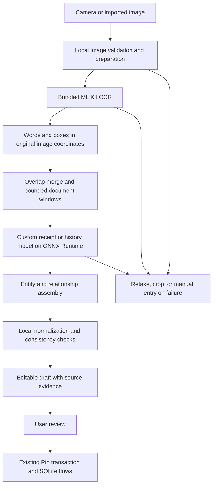

# Offline Receipt and Transaction History Scanner for Pip

**Status:** Proposed technical design; this document does not implement or train the scanner.  
**Updated:** 3 October 2026.  
**Target:** Pip's Android and iOS applications. Android is the first implementation target.

## 1. Decision and intended outcome

Build a scanner that converts receipt photos and transaction history screenshots into editable records inside Pip, entirely on the user's phone. Use an existing on-device OCR engine to read text, then a small, custom-trained model to identify fields and associate them with the correct items or transactions.

**Yes, the complete scanning pipeline can run locally on a smartphone without a cloud service.** Package the OCR resources, trained models, labels, and preprocessing configuration in the application. A fresh installation must be able to scan in airplane mode, including before any model has been warmed up or downloaded.

Training happens on the developer's computer, preferably with a GPU. Users' phones only run inference: they apply the already-trained model to new images. No LLM, remote inference API, API key, or generative model is required for scanning. There is no automatic cloud fallback.

The custom model learns document structure. It does not replace every component of the OCR engine. This is an intentional division of work: recognizing individual characters and understanding which amount belongs to which transaction are different problems.

Success means that users can import supported images, inspect the extracted evidence, correct uncertain values, and save valid transactions without connectivity. It does not mean that every layout or damaged receipt can be processed without correction.

## 2. Scope

### Supported first release

- Printed receipts photographed with a phone or imported from the gallery.
- Transaction history screenshots from explicitly tested e-wallet and banking layouts.
- Both individual screenshots and long screenshots within documented image limits.
- Latin-script English and Malay text, dates, currencies, and decimal amounts.
- Receipt merchant, date, items, quantities, item amounts, subtotal, discounts, charges, rounding, and total when present.
- Transaction descriptions, amounts, dates, direction cues, references, and statuses when present.
- Editing and saving through Pip's existing receipt and transaction review flows.

Chinese-and-Latin documents are a separate supported capability, enabled after the Chinese OCR pack and custom extraction model pass their own evaluation. Existing library support alone does not establish extraction accuracy.

### Outside the first release

- Handwriting, arbitrary PDFs, multipage statements, and account balance snapshots.
- Reading another app's private database or accessing an account directly.
- Automatically treating every incoming payment as income.
- Reconstructing unreadable or missing text by guessing.
- Training continuously on the user's phone.
- A guarantee of accuracy on every bank, wallet, language, or future layout.

Other Pip features, including chat and existing document import features outside receipt/history image scanning, have their own network behavior. This design establishes an offline scanner, not an offline guarantee for the entire application.

## 3. Current Pip integration points

The following observations describe the checkout inspected for this design. Some files already have unrelated changes in progress.

| Existing component | Current behavior | Change needed for this scanner |
| --- | --- | --- |
| `src/lib/receiptOcr.ts` | Runs native OCR and returns flattened text. | Expose words, bounding boxes, line relationships, script, and image coordinates through a new structured OCR adapter. |
| `src/lib/prepareScanImage.ts` | Prepares text, images, or a hybrid for the existing scan flow. | Reuse appropriate image preparation helpers, but give offline scanning a separate entry point. |
| `src/lib/longScan.ts` | Slices tall images, merges OCR text, and deduplicates extracted transactions. | Retain coordinates, verify complete coverage, and deduplicate overlapping observations by location rather than transaction content. |
| `src/billing/scanProxy.ts` | Receipt/history extraction can call configured LLM providers or a server proxy. | Stop routing receipt/history image scans through these remote extraction paths. Preserve unrelated features. |
| `src/lib/scanReceipt.ts` | Wraps receipt extraction, quota handling, and cloud-oriented errors. | Route to the local service and return scanner-specific results. |
| `src/lib/parseReceipt.ts` | Defines `ScannedReceipt` and normalizes extracted receipt values. | Use only a reviewed compatibility adapter; preserve richer evidence and uncertainty before this boundary. |
| `src/lib/parseExtraction.ts` | Parses extracted transaction JSON and supplies some defaults. | Do not feed local predictions through a parser that silently resolves missing values. |
| `src/screens/ScanKindScreen.tsx` | User chooses receipt or transactions. | Reuse the explicit choice; no document classifier is necessary initially. |
| `src/screens/ExtractScreen.tsx` | Displays extracted transactions and handles scan errors/quotas. | Display local drafts, progress, uncertainty, and correction state. |
| `src/screens/ReceiptScanScreen.tsx` | Maps receipt results into item assignment and saving. | Integrate evidence-based review and distinguish scan failure from manual entry. |
| `src/screens/AddFlow.tsx` | Coordinates adding transactions and already has local categorization logic. | Keep categorization separate from extraction and preserve offline operation. |
| `src/billing/scanQuota.ts` | Entangles scanning access with existing allowance/BYOK behavior. | Separate product access policy from model execution and cloud accounting. |
| `tools/ocrEval/` | Contains an extraction evaluation harness. | Extend it for structured OCR, local predictions, strict row matching, and device measurements. |

The installed `@react-native-ml-kit/text-recognition` package uses Google ML Kit on both platforms. Its Android dependencies currently use bundled `com.google.mlkit` recognition libraries. Its iOS podspec includes GoogleMLKit recognition pods. An existing comment describing the iOS path as Apple Vision should not be used as the integration contract.

The wrapper exposes text and geometric information, but its current JavaScript types do **not** expose OCR confidence. Do not invent a confidence value or interpret a missing value as perfect confidence.

## 4. Architecture



Each layer has one responsibility:

1. **OCR:** identify visible text and where it appears.
2. **Extraction model:** classify text regions and predict relationships between them.
3. **Assembler:** build receipt items or transaction rows from those predictions.
4. **Normalizer and validator:** parse values, detect inconsistencies, and preserve unknowns.
5. **Review:** let the user confirm or correct the resulting draft.
6. **Persistence adapter:** convert confirmed data into Pip's existing application types.

The model never writes directly to the transaction database. It produces predictions associated with image evidence.

### Alternatives considered

| Approach | Strength | Limitation | Role |
| --- | --- | --- | --- |
| OCR plus layout rules | Fast to implement, easy to debug, small runtime. | Rules become brittle when layouts change. | Required baseline and deterministic parsing helpers. |
| OCR plus a compact learned layout model | Learns field identity and associations while retaining evidence; practical to run locally. | Requires annotated examples and careful mobile deployment. | Selected production direction. |
| A new end-to-end image-to-structure model | Could learn visual cues and extraction jointly. | Substantially greater data, training, and deployment burden. | Defer until a measured limitation justifies it. |

Training a new OCR recognizer from scratch is not the starting point. First measure whether errors come from OCR or from field/row interpretation. Improving the wrong component will not improve the final result.

## 5. Technology stack

| Layer | Choice | Notes |
| --- | --- | --- |
| App | Existing React Native 0.81.5, React 19.1, Expo SDK 54, TypeScript | Versions observed in the current package manifest; do not upgrade the app as part of this feature without a separate need. |
| Capture/import | Expo Image Picker camera/gallery entry points | Use basic capture and local image import for the guaranteed offline path; do not depend on downloading a document scanner UI. |
| Image preparation | Expo Image Manipulator initially; a small native image module if necessary for safe region decoding | Preserve orientation and coordinate transforms. |
| OCR | Existing `@react-native-ml-kit/text-recognition` with bundled resources | Retain Latin; enable additional scripts only with matching validation. |
| Training | Python 3.11, PyTorch, NumPy | Pin a tested dependency set in a lockfile. |
| Data tooling | Local annotation interface or locally hosted Label Studio; Pillow/OpenCV for developer-side image processing | Annotation data stays on a controlled development machine. |
| Metrics/calibration | NumPy and scikit-learn, with custom document/row metrics | Calibration uses held-out examples. |
| Model format | ONNX | Export only operations verified on the mobile runtime. |
| Phone inference | `onnxruntime-react-native` | New native dependency; begin with the CPU execution provider. |
| Asset packaging | Expo/Metro static assets plus a local model manifest | Bundle model files inside the installed application. |
| Local data | Existing Expo SQLite and application repositories | Store approved transactions through existing flows. |
| Verification | Existing Jest/TypeScript checks, Python evaluation scripts, physical-device tests | Model quality and mobile behavior require separate checks. |

Choose the exact ONNX Runtime and PyTorch versions after a minimal export-and-run test on the current Expo/RN build. Record them together; “latest” is not a reproducible dependency specification.

Native OCR and ONNX Runtime require a development build or a release build. Expo Go is not the test environment for this feature. Expo describes this distinction in its [development build documentation](https://docs.expo.dev/develop/development-builds/introduction/), and ONNX Runtime provides a [React Native package](https://onnxruntime.ai/docs/get-started/with-javascript/react-native.html).

## 6. Image processing and structured OCR

### 6.1 Input preparation

Use the basic camera/gallery path for this scanner. The installed Android document scanner plugin depends on `play-services-mlkit-document-scanner`, whose scanning UI and resources can be downloaded on first use. That is distinct from the bundled OCR recognizer. Do not make this plugin a prerequisite for a fresh offline scan; provide local crop/rotation controls instead. Google documents the distinction in its [document scanner integration guide](https://developers.google.com/ml-kit/vision/doc-scanner/android).

An image selected from the gallery must already be available locally. If a photo library exposes a cloud-only item, explain that it must first be downloaded by the user or replaced with a local photo; the scanner should not initiate a hidden fetch.

1. Read dimensions and orientation before allocating large decoded images where the platform permits.
2. Apply the orientation transform and preserve the mapping back to the displayed image.
3. Let the user crop irrelevant borders and correct obvious rotation.
4. Avoid aggressive thresholding by default; screenshots can contain meaningful colors and thin text.
5. Process at a resolution that preserves small amounts and dates. Do not shrink an entire long screenshot to a small thumbnail.
6. Enforce image and working-memory limits. If an input cannot be fully processed, ask the user to crop or split it.

Start with a configurable 24-megapixel input ceiling and process tiles sequentially. This is a conservative starting setting to benchmark, not evidence that every supported phone can decode a 24-megapixel image safely. A decoded RGBA buffer alone consumes roughly four bytes per pixel, before copies and OCR allocations.

For oversized images, implement native region decoding or reject the image with a useful cropping action. Do not assume that a JavaScript crop operation avoids decoding the complete original image.

### 6.2 OCR document contract

The OCR adapter should return a structured document resembling:

```ts
type Box = { x0: number; y0: number; x1: number; y1: number };

type OcrWord = {
  id: string;
  text: string;
  box: Box;                 // Pixels in the oriented original image.
  lineId: string;
  tileId: string;
  confidence: number | null; // Null with the current ML Kit wrapper.
};

type OcrDocument = {
  imageWidth: number;
  imageHeight: number;
  words: OcrWord[];
  script: 'latin' | 'chinese';
  engineVersion: string;
  coverageComplete: boolean;
};
```

Preserve original text separately from normalized text used for features. Retain a transform for each crop/tile. Word boxes from that crop must be translated and scaled into the same original-image coordinate system before merging.

### 6.3 Long screenshots

- Start with tiles around 1,200 pixels high with approximately 20% overlap, adapting to source resolution and text size.
- Extend or shift boundaries to avoid cutting a line where possible.
- Match overlapping OCR observations using both spatial overlap and text similarity. Assign one canonical word ID to observations of the same source text.
- Preserve a coverage map. If a tile fails or a tile limit is reached, mark the document incomplete and prevent a misleading “all transactions scanned” result.
- Carry the preceding date heading into later model windows as context, without creating a new copy of the transaction.
- Merge model results by canonical word/entity IDs.

**Never remove a row merely because its merchant, amount, and date equal another row.** Two identical purchases can be real transactions. The existing content-based deduplication in `longScan.ts` is unsuitable as the identity rule for this scanner.

For separate overlapping screenshots, suggest possible duplicates during review. Only automatically merge when there is sufficiently strong identity evidence, such as the same reliable transaction reference. Keep the user's ability to retain both.

## 7. The custom model

### 7.1 What it learns

The model receives OCR words and their positions. For each word, it predicts a semantic role. For selected pairs of words, it predicts a relationship.

Example receipt:

```text
Coffee             2      8.00      16.00
TOTAL                              16.00
Cash                               20.00
Change                              4.00
```

The model must distinguish quantity, unit price, line amount, total, tendered cash, and change. Detecting every number correctly is not sufficient.

Example transaction history:

```text
12 September 2026
Corner Store                         -18.50
Transfer received                    +50.00
Balance                             210.00
```

The model must attach the date heading to both rows and exclude the balance from transactions. The second row has an incoming direction cue; its accounting type still needs interpretation or user confirmation.

### 7.2 Initial architecture

Use a small text-and-layout encoder with two task-specific model files: one for receipts and one for transaction histories. The user already selects the task, so loading both simultaneously is unnecessary.

| Component | Initial design |
| --- | --- |
| Input window | Up to 256 OCR words, with padding and a valid-word mask. |
| Word representation | UTF-8 byte embeddings, followed by small 1D convolutions and max pooling within each word. |
| Byte handling | Vocabulary of 257 values: padding 0, byte values shifted by 1. Up to 96 bytes per segment. Split longer words at character boundaries and retain parent/offset metadata. |
| Geometry | Eight features: normalized left, top, right, bottom, center X, center Y, width, height. Coordinates are relative to the complete oriented image. |
| Auxiliary features | Digit fraction, letter fraction, CJK fraction, plus/minus presence, decimal-separator presence, currency-symbol presence, and numeric/date candidate flags. Freeze their definitions and order in the preprocessing manifest. |
| Encoder | Two attention layers, hidden width 128, four heads, with relative geometry bias. This is a small supervised encoder, not a generative language model. |
| Field head | A linear classification head over task-specific labels. |
| Relation head | Low-rank pair scoring for four relationship types. Avoid materializing a tensor of shape `N × N × hidden_width`. |
| Parameter budget | Aim for no more than 3 million parameters per task model. Measure the actual count after implementation. |

Represent attention using exportable standard tensor operations. Avoid an initial dependency on graph scatter operations or custom ONNX operators. Every padded token must be masked consistently; empty OCR results bypass the model entirely.

Expected outputs are field logits of shape `[1, 256, C]` and relation logits of shape `[1, 4, 256, 256]`, where `C` is the label count for that task. Masked entries never become evidence.

The four relations are:

1. **Same entity:** neighboring tokens belong to one description, date, or amount span.
2. **Same row:** distinct entities belong to one receipt item or transaction.
3. **Date scope:** a date heading governs a transaction row.
4. **Key-value:** a label such as “TOTAL” identifies its associated value.

Use relation-specific candidate masks to reduce impossible associations. Date-scope candidates must include carried date headings, even if they are not immediate spatial neighbors. The assembler resolves conflicting links and reports ambiguity instead of greedily joining the whole document.

A compact model trained from scratch may need more diverse data than initially available. It is a starting architecture to test against the rules baseline, not a promise of higher accuracy.

### 7.3 Label sets

Receipt labels should include:

```text
OTHER, MERCHANT, RECEIPT_DATE,
ITEM_DESCRIPTION, ITEM_QUANTITY, ITEM_UNIT_PRICE, ITEM_AMOUNT,
SUBTOTAL_LABEL, SUBTOTAL_VALUE,
DISCOUNT_LABEL, DISCOUNT_VALUE,
SERVICE_LABEL, SERVICE_VALUE,
TAX_LABEL, TAX_VALUE,
ROUNDING_LABEL, ROUNDING_VALUE,
TOTAL_LABEL, TOTAL_VALUE,
CASH_TENDERED, CHANGE, CURRENCY
```

History labels should include:

```text
OTHER, DATE_HEADING, ROW_DATE, ROW_TIME, DESCRIPTION,
TRANSACTION_AMOUNT, DIRECTION_CUE, CURRENCY,
REFERENCE, STATUS, BALANCE, ACCOUNT_LABEL
```

For quantity and money, preserve both the printed string and its parsed value. A missing quantity is unknown, not automatically one. A missing unit price need not prevent importing a clearly printed line amount.

### 7.4 Visual information that OCR cannot supply

The initial extraction model uses text and layout. It cannot reliably infer a meaning encoded only in an icon or color when that information is absent from the OCR result.

For example, if a wallet marks incoming payments only with a green arrow, the direction stays unresolved in this version. Users confirm it in review. A later extension can add a small supervised crop classifier for known direction/status icons, with its own labeled data and evaluation. Do not quietly infer “expense” whenever no plus sign is found.

## 8. Draft representation and deterministic processing

### 8.1 Keep evidence and uncertainty

Existing application types are final-use types. Introduce a richer intermediate representation:

```ts
type Evidence = {
  wordIds: string[];
  box: Box;
  text: string;
};

type Field<T> = {
  value: T | null;
  rawText: string | null;
  evidence: Evidence[];
  confidence: number | null;
  origin: 'observed' | 'derived' | 'user';
  needsReview: boolean;
};

type Money = {
  minorUnits: number; // Integer; validate Number.isSafeInteger.
  currency: string;
};

type TransactionDraft = {
  id: string; // Stable within this scan, based on source identity.
  description: Field<string>;
  amount: Field<Money>;
  date: Field<string>; // ISO date only when fully resolved.
  direction: Field<'in' | 'out'>;
  type: Field<'expense' | 'income' | 'transfer'>;
  reference: Field<string>;
  status: Field<string>;
  warnings: string[];
};
```

The complete result also includes `scanId`, task kind, model version, OCR version, image reference, receipt-specific fields where applicable, processing status, and `coverageComplete`.

Receipt drafts retain an item list, printed summary fields, individual discounts/charges, and an itemization-completeness flag. Preserve amounts as integer minor units with a currency-specific exponent; not every currency has two decimal places.

If a currency is unresolved, keep the amount's raw evidence and leave `Money` unresolved until the user chooses a currency. Never discard an otherwise recognizable row solely because one field is missing.

### 8.2 Normalization rules

- Parse decimal and grouping separators using document context; flag ambiguous strings such as `1.234`.
- Treat currency symbols such as `$` as ambiguous unless another source identifies the currency. The user's default currency can be offered as a visible suggestion.
- Preserve missing years and ambiguous day/month ordering for review. Do not silently use today's date.
- Resolve “Today” and “Yesterday” only with a reliable reference date. A screenshot's file modification date is not reliable evidence of when its contents were displayed.
- Separate movement direction from accounting type. Incoming transfers between a user's own accounts are not income.
- Keep failed, pending, reversed, and completed statuses distinct. Do not automatically import unsuccessful payments as completed spending.
- Exclude balance values from transaction rows unless the user explicitly chooses a different interpretation.
- Preserve observed values when a consistency check fails. Never rewrite a recognized amount just to make a total balance.

### 8.3 Receipt consistency

When the document provides the necessary fields, compare the printed total with an appropriate calculation using item amounts, discounts, service charges, taxes, and rounding. The exact calculation depends on whether tax is included, where a discount applies, and how charges are defined.

Do not assume every receipt follows `subtotal + tax + service - discount`. Unknown tax inclusion or discount timing produces a review warning. Keep printed charge amounts instead of reconstructing them from a guessed percentage.

A total-only receipt can still be entered as one expense after confirmation. Item-based splitting must remain unavailable or explicitly incomplete until missing items are resolved. The scanner must not manufacture an item list from the total.

### 8.4 Confidence and fallback

Raw softmax scores are not reliable probabilities of correctness. Calibrate field and relation scores on held-out data. Record absent OCR confidence as null; do not multiply in a fictional OCR score.

Use field-specific thresholds and validation checks to determine what needs attention. Do not create one arbitrary average “document confidence” that hides a low-confidence amount.

All scans enter review in the first release. Strong predictions can be prefilled, but importing still requires a deliberate user action. Missing required values, incomplete screenshot coverage, or unresolved inconsistencies prevent saving the affected rows until resolved or explicitly excluded.

On failure, offer cropping, retaking, an explicitly selected alternate local OCR script, or manual entry. A limited local retry must not turn into a remote request.

## 9. Data collection and annotation

### 9.1 Data sources

Use personally owned images and appropriately licensed public datasets. Receipt datasets can initialize receipt extraction, but they do not substitute for real transaction history screenshots.

| Source | Useful supervision | Limitation |
| --- | --- | --- |
| Own receipts | Actual merchants, languages, lighting, and phone capture conditions. | A single person's collection can have narrow layout coverage. |
| Own wallet/bank screenshots | Actual row layouts, headings, statuses, and direction conventions. | Repeated screenshots of a few providers do not demonstrate broad coverage. |
| SROIE | Receipt OCR and selected key fields. | It is not a complete item/relationship annotation source. |
| Public CORD release | Receipt item and structured field examples. | Some original fields are removed; map the labels actually present in the release. |
| Synthetic images | Controlled stress tests, rare formats, and optional augmentation. | Synthetic test success does not establish accuracy on real documents. |

CORD's repository documents a public release of 1,000 receipts with an 800/100/100 split; do not confuse the larger original collection with the downloadable subset. See the [CORD repository](https://github.com/clovaai/cord) and [SROIE benchmark description](https://arxiv.org/abs/2103.10213).

Check each source's license and redistribution terms before shipping derived assets or publishing images. Public availability does not automatically permit every commercial or redistribution use.

### 9.2 Annotation process

1. Assign an image ID, task, language/script, provider or merchant layout family, and acquisition group.
2. Run the same OCR engine/configuration used by the phone pipeline.
3. Annotate visible ground-truth text and fields against the image, independently of whether OCR recognized them.
4. Align field labels and relationships to recognized words where possible.
5. Record OCR omissions and misrecognitions separately. Do not erase an error by changing the ground truth to match the OCR output.
6. Annotate entity spans, item/transaction membership, date scope, and relevant key-value links.
7. Review ambiguous examples and maintain a written annotation guide.

Maintain both image-level truth and OCR-aligned training labels. This allows separate measurement of OCR failure and extraction failure.

ML Kit is a mobile SDK, so the Python training program should consume exported OCR JSON rather than assume it can call the same recognizer on a desktop. Build a developer-only batch utility in the native app to process approved dataset images and export words, boxes, image IDs, and OCR version through a local file/USB workflow. Run representative images on both Android and iOS: their OCR output can differ. Keep those platform variants in the same dataset split and evaluate each platform separately.

Partially labeled datasets need explicit annotation masks. For example, a dataset with only merchant/date/total annotations must not teach the model that every unannotated item word is `OTHER`.

### 9.3 Practical starting quantities

Start with approximately 100 receipts and 100 history images to validate the schema and expose failure modes. For a first substantial training set, plan around 500–1,500 diverse receipt images and 400–1,000 history images, adding examples where errors concentrate.

These are collection estimates, not sufficiency guarantees. Twenty near-identical screenshots add much less coverage than twenty different layouts and capture conditions. Measure learning curves before committing to a larger collection.

### 9.4 Splits and leakage prevention

- Group duplicates, crops, overlapping screenshots, augmentations, and repeated captures of the same underlying document together.
- Keep groups in exactly one split.
- For custom data, begin with 70% training, 15% validation, 5% calibration, and 10% test by group, adjusting before training if a split is too small.
- Maintain an additional held-out-layout test where some merchant/provider layout families never appear during training.
- Preserve official public test splits when reporting performance on those datasets.
- Never tune rules, thresholds, or model choices against the final test set.

If calibration data is too small to support reliable thresholds, keep all relevant fields marked for review instead of presenting unjustified probabilities.

### 9.5 Privacy and storage

Keep private images outside Git and outside default cloud-synced folders. Add explicit ignore rules before creating a repository-local data directory. Use opaque IDs in filenames; keep identity metadata separate.

Redact account identifiers and unrelated personal details in shared examples. Redaction can change layouts, so validate that it does not create artificial cues. Do not retain real financial identifiers in committed fixtures.

User corrections stay on the device by default. They may update the current draft, but they are not silently uploaded or added to a training set. Any future contribution flow must be a separate, deliberate export action.

## 10. Training guide

### 10.1 Build the baseline first

Implement OCR plus transparent rules for likely dates, amounts, total labels, and row grouping. Evaluate it on the same splits as the learned model.

The baseline provides a working reference, reveals OCR limitations, and makes it possible to reject a more complicated model if it does not help.

### 10.2 Training stages

1. **Field labels:** train the encoder and field head using OCR words and bounding boxes.
2. **Relationships:** add entity, row, date-scope, and key-value supervision. Include hard negatives such as nearby amounts from adjacent rows.
3. **Joint training:** optimize field and relationship losses together; initially give the two loss families equal weight after normalizing for valid examples.
4. **Calibration:** fit score calibration and review thresholds on the reserved calibration split.
5. **End-to-end evaluation:** run the complete image-to-draft pipeline on untouched test images.

Use weighted cross-entropy or a comparable imbalance-aware loss for field labels. For relationships, use masked binary losses and balanced negative sampling so the huge number of unrelated word pairs does not dominate training.

A reasonable initial training configuration is:

```yaml
window_words: 256
word_byte_limit: 96
hidden_width: 128
encoder_layers: 2
attention_heads: 4
batch_size: 8
optimizer: adamw
learning_rate: 0.0003
weight_decay: 0.01
max_epochs: 40
early_stopping_patience: 6
warmup_fraction: 0.05
gradient_clip_norm: 1.0
seeds: [17, 29, 43]
```

Treat these as initial experiment settings. Select checkpoints using validation performance on meaningful fields and complete rows, not training loss alone. Reduce batch size if memory requires it.

A GPU with roughly 8–12 GB of VRAM is a reasonable development target for this compact architecture, subject to an actual memory benchmark. CPU training is possible but may be slow. Phone hardware does not need that GPU because it is only performing inference.

### 10.3 Augmentation

Use mild rotation, brightness changes, blur, compression, and realistic OCR perturbations. Apply image transforms before OCR, or correctly transform boxes if working from cached OCR.

Do not randomly delete a sign, decimal, or digit while leaving the target unchanged unless the example is explicitly intended to teach uncertainty. Augmentation must not reward reconstructing invisible financial values.

### 10.4 Training artifacts

Every accepted training run should produce:

- A checkpoint, model architecture configuration, and dependency lockfile.
- Label maps, feature definitions, and preprocessing version.
- Dataset version, group split manifest, seed, and training configuration.
- Validation/test metrics and categorized failure examples without private data in public logs.
- Calibration parameters and review thresholds.
- Exported ONNX files and desktop/mobile parity results.

No LLM-generated annotations or distillation teacher are required by this design. Supervision comes from annotated images and supported public labels.

## 11. Evaluation and release criteria

### 11.1 Quality metrics

| Metric | Why it matters |
| --- | --- |
| OCR character/word error rates | Separates reading errors from extraction errors. |
| Per-field precision, recall, and F1 | Prevents common labels from hiding failures on totals, dates, or references. |
| Exact normalized amount accuracy | A one-cent error is still an amount error. |
| Complete transaction precision/recall/F1 | Tests whether a whole row is usable, including required fields. |
| Receipt item association accuracy | Measures whether descriptions, quantities, and amounts belong together. |
| Missing-row and extra-row counts | Exposes omissions and duplicate extraction. |
| Correction rate and correction time | Measures practical review effort. |
| Calibration and error-versus-coverage curves | Shows whether stronger confidence actually means fewer errors. |
| Per-layout/language/device results | Exposes coverage gaps hidden by aggregate scores. |

Match predicted and true rows one-to-one, preserving multiplicity. Report detection and field accuracy over the complete ground truth, not only rows that happened to match. Matching only by amount can confuse repeated equal-value transactions.

Report two diagnostic conditions: extraction with ground-truth text/boxes, and the real image-to-OCR-to-extraction pipeline. Only the latter describes actual user performance.

### 11.2 Initial engineering targets

These are acceptance targets to validate, not measured results:

| Area | Initial target |
| --- | --- |
| Custom model size | At most 3 million parameters per task; roughly 12 MB of FP32 weights per model before packaging overhead. |
| Combined custom model assets | Under 30 MB, excluding OCR packs, runtime, and app assets. |
| Memory | Aim for less than 200 MB additional peak working memory on the reference device. |
| Receipt latency | Warm P95 image-to-draft latency under 3 seconds on a selected midrange 4 GB Android phone. |
| History latency | Warm P95 under 10 seconds for a defined benchmark containing up to 120 visible transactions. |
| Correctness versus baseline | At least match the baseline on critical exact-value metrics and improve a predefined row/association metric or correction burden. |
| High-confidence critical fields | Target fewer than 1% incorrect accepted predictions on a sufficiently large held-out set; publish sample counts and uncertainty internally. |
| Offline behavior | Fresh release install, no API key, no previous model download, successful scan in airplane mode. |

Also record cold-start latency, total installation-size increase, battery/thermal behavior during repeated scans, and low-memory failure behavior. If evidence is insufficient for a quality target, narrow supported layouts or require more review; do not present the target as achieved.

## 12. Exporting and running the model on a phone

### 12.1 Prove deployment before expensive training

Create a randomly initialized instance of the exact proposed architecture and export it. Run a fixture through ONNX Runtime on Android and iOS before collecting a large dataset or conducting long training runs.

This test establishes operator support, tensor dtypes, asset loading, output shape, memory usage, and native build compatibility. Random predictions are fine for this deployment check; they do not test accuracy.

### 12.2 Export contract

- Export the field and relation heads together.
- Use fixed window dimensions initially; pad short windows and split longer documents explicitly.
- Use named inputs such as `word_bytes`, `boxes`, `features`, and `word_mask`.
- Specify integer dtypes for byte indices and floating-point dtypes for features in the manifest; test those exact types through the React Native bridge.
- Choose an ONNX opset supported by the pinned runtime and verify every exported operator. Do not assume a newer exporter is compatible with an older mobile runtime.
- Run the ONNX checker and compare PyTorch versus ONNX outputs and assembled fields on a fixture set.
- Repeat parity checks on actual phones, including empty/masked inputs and dense windows.

Use the official [PyTorch ONNX export documentation](https://docs.pytorch.org/docs/stable/onnx.html) for the pinned training release. The export script should be maintained alongside the model code.

### 12.3 Quantization

Ship FP32 first if it meets the budget. The models are deliberately small; unnecessary quantization work can delay a working scanner.

If size or latency needs improvement, evaluate INT8 quantization on supported linear operations, keeping sensitive or unsupported operations in floating point. Static quantization needs representative calibration inputs; dynamic quantization has different runtime requirements. Check the actual mobile kernels used by the exported model.

Re-run exact-value, row, calibration, and phone performance evaluations after quantization. Use an initial maximum quality-loss budget of 0.5 percentage points on critical metrics, and inspect whether the loss disproportionately affects a language or layout. Smaller weight files do not guarantee faster inference or a fourfold reduction in the whole app's size. See [ONNX Runtime quantization guidance](https://onnxruntime.ai/docs/performance/model-optimizations/quantization.html).

### 12.4 Runtime and packaging

1. Add `onnxruntime-react-native` after the compatibility check.
2. Extend the existing Metro configuration to include `.onnx` in asset extensions, preserving its existing settings.
3. Bundle model assets with static references and a versioned manifest.
4. Resolve models to a local filesystem path. If the runtime needs a writable path, copy from the installed bundle into private app storage and verify the file hash.
5. Create one cached session for the selected task, run bounded windows sequentially, and release sessions when memory pressure requires it.
6. Start with the CPU provider. Test NNAPI/Core ML acceleration later against actual supported operators and physical devices.

Expo Asset loading in a development server or an over-the-air update can involve a download. Calling an asset download helper is not proof of offline support. Verify that the release binary contains every required model and that local loading never depends on a network URI.

Keep a manifest such as:

```json
{
  "packVersion": "1.0.0",
  "schemaVersion": 1,
  "preprocessingVersion": "1",
  "tasks": ["receipt", "transactions"],
  "maxWords": 256,
  "maxWordBytes": 96,
  "requiredFiles": [
    "receipt.onnx",
    "history.onnx",
    "receipt-labels.json",
    "history-labels.json",
    "calibration.json",
    "preprocessing.json"
  ]
}
```

The release generator additionally writes the actual SHA-256 and size of every file, model input/output names and dtypes, tested runtime versions, and supported scripts. Reject an incompatible or incomplete pack as a local initialization error; do not fetch replacements silently.

The current Android OCR package already uses bundled recognition libraries. Keep that property. Google distinguishes bundled recognition from Play Services models that may need downloading in its [Android OCR documentation](https://developers.google.com/ml-kit/vision/text-recognition/v2/android). Verify iOS packaging independently using the [iOS OCR documentation](https://developers.google.com/ml-kit/vision/text-recognition/v2/ios).

The installed wrapper includes multiple script libraries. If reducing that footprint, make a persistent package patch or maintained wrapper change and test both native builds. Do not rely on manual edits inside `node_modules`.

## 13. Application integration

### 13.1 Proposed file organization

The following paths are proposed; this document does not create these modules:

```text
src/scanner/
  types.ts                    # OCR, draft, status, and error contracts
  scanDocument.ts             # Public offline orchestration service
  imagePreparation.ts         # Orientation, limits, tiling, transforms
  ocrAdapter.ts               # ML Kit structured output
  mergeObservations.ts        # Geometry-based overlap merge
  windowDocument.ts           # Bounded inputs and carried date context
  features.ts                 # Versioned model inputs
  modelAssets.ts              # Bundled pack validation and local paths
  modelRuntime.ts             # Session lifecycle and inference
  assembleReceipt.ts          # Receipt entities, items, and totals
  assembleTransactions.ts     # History rows and date association
  normalize.ts                # Money, dates, currency, and direction
  validate.ts                 # Warnings and save eligibility
  reviewAdapters.ts           # Confirmed drafts to existing Pip types
  draftStore.ts               # Local review state and source cleanup

assets/models/scanner/v1/
  receipt.onnx
  history.onnx
  manifest.json
  receipt-labels.json
  history-labels.json
  calibration.json
  preprocessing.json

tools/offlineScanner/
  configs/
  scanner_training/
  fixtures/                   # Synthetic or approved non-private examples
  README.md
```

Keep model artifacts and reusable implementation code separate from private training data. Add native functionality through an Expo module, config plugin, or maintained package patch as appropriate; generated `android/` and `ios/` files are not the durable source of truth in this repository.

### 13.2 Public service contract

```ts
type ScanRequest = {
  scanId: string;
  uri: string;
  kind: 'receipt' | 'transactions';
  script: 'latin' | 'chinese';
  signal?: AbortSignal;
  onProgress?: (event: {
    stage: 'preparing' | 'reading' | 'extracting' | 'checking';
    completed: number;
    total: number | null;
  }) => void;
};

// Proposed API; implementation will define the task-specific ScanResult union.
declare function scanDocument(request: ScanRequest): Promise<ScanResult>;
```

Return explicit result states: `ready_for_review`, `incomplete`, `no_text`, `unsupported`, `cancelled`, and `failed`. Include structured error codes such as `IMAGE_TOO_LARGE`, `MODEL_UNAVAILABLE`, and `OCR_FAILED`.

Do not reuse `LLMError`, “API key missing,” or “provider unavailable” for local failures. Limit the service to one active scan initially. Native OCR/inference may not cancel immediately; cancellation must discard stale results and stop subsequent windows. Prevent late results from replacing a newer draft.

### 13.3 Receipt flow

1. `ReceiptScanScreen` receives a local image and calls the scanner.
2. Display separate progress for OCR and extraction.
3. Present merchant/date, items, and printed summary fields with review warnings.
4. Let a user tap a field to highlight its source region.
5. Preserve original observations when the user edits values, while marking the chosen value as user-supplied.
6. After review, map confirmed data to `ScannedReceipt` and the existing assignment/save flow.

The current receipt type lacks some useful fields, including receipt date, rounding details, and extraction evidence. Keep these in the draft and extend the application model only where required for a correct save. Do not discard rounding just to fit the old interface or force a discount into an assumed timing.

An extraction error must lead to a clear retry/manual-entry state. It must not masquerade as a successful empty receipt. Total-only entry remains available as an intentional user choice.

### 13.4 Transaction history flow

1. Replace receipt/history image calls to `submitScan` with the local service at the appropriate entry points.
2. Preserve drafts across navigation, including edits, warnings, model version, and source identity.
3. Show transaction rows and excluded balance/status information distinctly.
4. Require resolution of missing amount/currency/date/accounting type where the save flow needs them.
5. Convert confirmed rows to `ExtractedTxn[]` through a dedicated adapter.
6. Continue into Pip's existing categorization and save flow.

The existing `ExtractedTxn` requires fields that the scanner may not know. That is why conversion happens after review. Preserve original currency/native amount and let existing confirmed currency-conversion flows handle ledger amounts. Scanning itself must not fetch exchange rates.

Receipt/history attachments opened through chat or shared add flows must route to this same local service. Changing only the main scan screen would leave accidental remote scanning paths behind. Audit call sites in `App.tsx`, `AddFlow.tsx`, attachment flows, and `scanProxy.ts` before declaring the migration complete.

### 13.5 Quotas, entitlements, and offline access

Model execution must not depend on an API key, a remote allowance check, or a successful billing refresh.

For a migration that preserves the current Free/Pro numeric limits, use a separate local policy: Free gets 3 successful scans per UTC day and 20 per UTC month; Pro gets unlimited scanning while locally entitled. Keep this policy outside the inference engine so pricing can change without changing models.

- Use cached entitlements without blocking scanning on a network call. The existing entitlement cache has a seven-day grace policy; after expiration, local access falls back to the Free policy until entitlement can be refreshed.
- A fresh offline installation can scan within the Free allowance.
- A BYOK key has no technical role in this scanner and does not authorize model loading.
- Count a usable result once per stable `scanId`; reopening review or retrying the same completed job must not count again.
- Failed, cancelled, or empty scans do not consume a successful-scan allowance.
- Keep cloud counters separate and do not call the cloud scan proxy to increment them.

Entirely offline counters cannot provide tamper-proof usage enforcement against device clock changes or reinstalls. Accept that limitation or revise the commercial policy separately; do not reintroduce a server dependency into scanning to hide it.

### 13.6 Local storage and data handling

Store only the draft data needed to resume review. Keep imported working copies in private app storage and remove temporary tiles when a scan finishes or is abandoned. Retain a source image only for the duration needed for review or when the user explicitly chooses an attachment feature.

Do not log OCR text, images, account references, or transaction amounts to analytics/crash reports. Error reports can contain model version, stage, duration, device class, and non-sensitive error codes.

Offline processing does not automatically mean encrypted-at-rest storage: the existing SQLite setup must be assessed separately before making that claim. Review OS backup behavior for retained images and drafts. A local-only scanner must not silently add source documents to a cloud backup workflow.

## 14. Brief implementation sequence

Each phase should end with a working, inspectable result before expanding scope.

| Phase | Work | Completion evidence |
| --- | --- | --- |
| 1. Mobile feasibility | Export the untrained architecture; add a minimal native inference harness; load bundled OCR/models. | A fresh Android release build runs a fixture in airplane mode; an iOS build confirms the same contract. |
| 2. Structured input | Implement OCR boxes, transforms, tiling, canonical IDs, and coverage tracking. | Hand-checked fixtures preserve coordinates and repeated real transactions. |
| 3. Baseline and data | Write the annotation guide, group splits, baseline parser, and end-to-end evaluator. | Baseline metrics plus independently checked ground truth. |
| 4. Train and assess | Train field/relation models, calibrate scores, inspect failures, and compare with baseline. | Reproducible held-out results demonstrating why the selected model is useful. |
| 5. Package and integrate | Export accepted weights, validate assets, integrate drafts and review adapters. | Receipt and history records save correctly through existing Pip flows. |
| 6. Harden and release | Test performance, privacy, cancellations, quotas, migrations, and unsupported inputs. | The release checklist below passes on physical devices. |

The training tool can expose commands such as the following once implemented. These are an intended CLI contract, not commands available in the repository today:

```bash
python -m scanner_training.prepare --config configs/receipts.yaml
python -m scanner_training.train --config configs/receipts.yaml
python -m scanner_training.evaluate --config configs/receipts.yaml --split test
python -m scanner_training.export --config configs/receipts.yaml
python -m scanner_training.verify_export --config configs/receipts.yaml
```

Use the equivalent history configuration for the second model. Do not automate training data collection from users as a prerequisite for this sequence.

## 15. Verification checklist

### Extraction and review

- [ ] Total, cash tendered, change, balance, and transaction amount remain distinct.
- [ ] Two genuine purchases with the same merchant, amount, and date remain two rows.
- [ ] Overlap between tiles produces one observation of the same source row.
- [ ] A transaction crossing a tile/window boundary remains associated with the correct date.
- [ ] Truncated input, failed tiles, and processing limits create visible incomplete states.
- [ ] Missing years, ambiguous currencies, and color-only direction cues stay unresolved.
- [ ] Failed/pending transactions do not silently become completed expenses.
- [ ] Receipt tax inclusion, discounts, rounding, and incomplete itemization are handled explicitly.
- [ ] User corrections survive navigation and are not overwritten by late inference results.
- [ ] Saved values match the reviewed draft, including currency and minor-unit precision.

### Mobile and offline behavior

- [ ] Fresh release installation scans in airplane mode before any first-run model download.
- [ ] Basic camera capture and local gallery import work without initializing the downloadable Android document scanner UI.
- [ ] Scanning works without an API key and without a successful billing/network refresh.
- [ ] Both platform builds load every supported OCR script and custom model from installed assets.
- [ ] Scanner code and native dependencies do not send document content or initiate remote inference, including when the phone is online.
- [ ] Cold/warm latency, peak memory, and repeated-scan thermal behavior are measured on a midrange Android phone and a supported iPhone.
- [ ] Large images fail safely without silent cropping or app termination.
- [ ] Cancelling, backgrounding, switching tasks, and low-memory conditions leave no stale saveable result.
- [ ] Model/manifest mismatches fail locally with a useful recovery action.
- [ ] Local quota counters are idempotent and separate from cloud scan usage.
- [ ] Source images and OCR strings do not enter analytics, crash payloads, or unintended backups.

### Deployment and maintenance

- [ ] Native builds are reproducible through maintained configuration, not manual generated-file edits.
- [ ] Training and phone preprocessing pass shared fixture comparisons.
- [ ] Exported and quantized models pass parity and quality checks.
- [ ] Feature rollback returns to a previous bundled local model or manual entry, never to an automatic cloud scanner.
- [ ] Each model update includes evaluation results, supported layouts/scripts, and compatible schema/preprocessing versions.

## 16. Reference documentation

- [ML Kit text recognition on Android](https://developers.google.com/ml-kit/vision/text-recognition/v2/android): bundled versus downloaded recognition resources.
- [ML Kit text recognition on iOS](https://developers.google.com/ml-kit/vision/text-recognition/v2/ios): native recognizer integration and script resources.
- [ML Kit document scanner on Android](https://developers.google.com/ml-kit/vision/doc-scanner/android): why the existing capture plugin must not be a first-use offline prerequisite.
- [ONNX Runtime for React Native](https://onnxruntime.ai/docs/get-started/with-javascript/react-native.html): mobile JavaScript integration.
- [ONNX Runtime mobile deployment](https://onnxruntime.ai/docs/tutorials/mobile/): execution providers, model preparation, and mobile constraints.
- [ONNX Runtime quantization](https://onnxruntime.ai/docs/performance/model-optimizations/quantization.html): supported approaches and accuracy considerations.
- [PyTorch ONNX export](https://docs.pytorch.org/docs/stable/onnx.html): exporting the trained network.
- [Expo development builds](https://docs.expo.dev/develop/development-builds/introduction/): using native libraries outside Expo Go.
- [Expo Metro configuration](https://docs.expo.dev/guides/customizing-metro/): bundling additional asset types.
- [CORD dataset repository](https://github.com/clovaai/cord): public receipt data, label definitions, and release limitations.
- [SROIE benchmark description](https://arxiv.org/abs/2103.10213): receipt OCR and selected key information extraction tasks.

External documentation is a starting reference. The pinned package versions, actual exported graph, installed application, and measured device behavior determine what this implementation supports.
