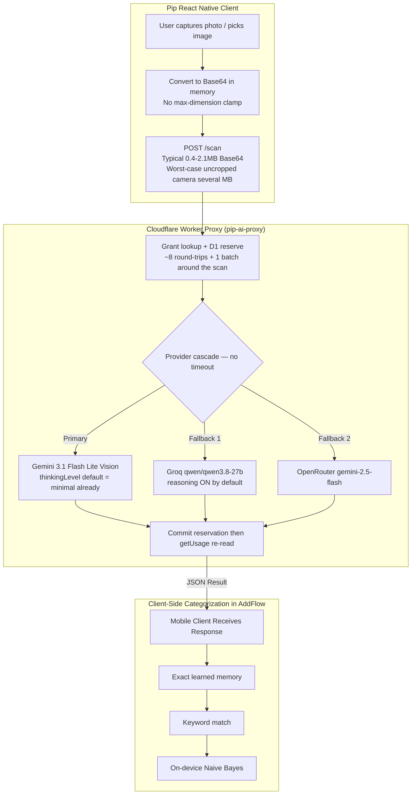
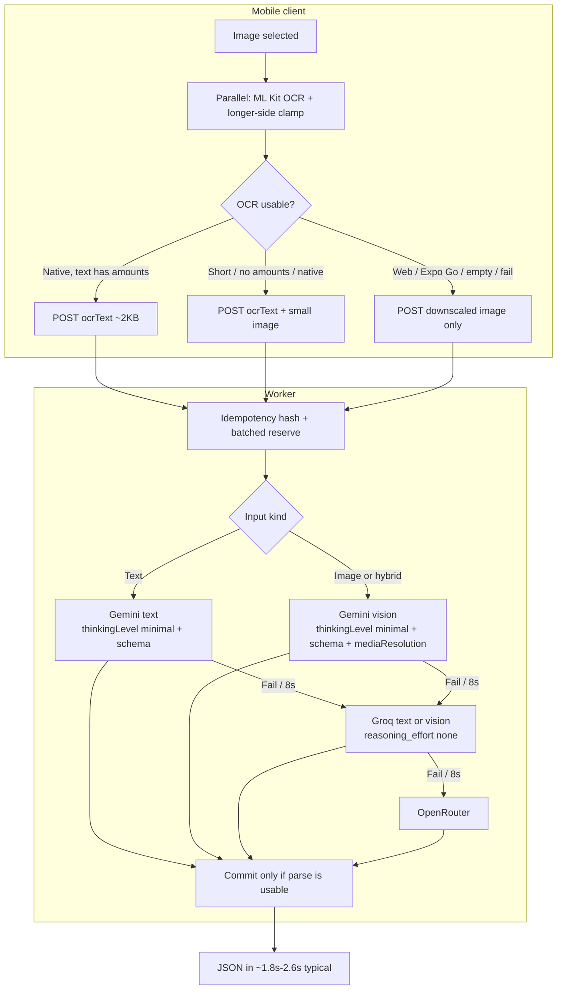

# Spec: Transaction Scanning & LLM Pipeline Performance Optimization

**Date**: 2026-09-15  
**Revised**: 2026-09-15 (code review against current worker/client + `evaluation_report.md`)  
**Target Models**: Google Gemini 3.1 Flash Lite (`gemini-3.1-flash-lite`), Groq Vision (`qwen/qwen3.8-27b`), OpenRouter (`google/gemini-2.5-flash`)  
**Target Surface**: `src/screens/ExtractScreen.tsx`, `src/screens/AttachScreen.tsx`, `src/screens/ReceiptScanScreen.tsx`, `src/screens/BalanceScanScreen.tsx`, `src/lib/scanReceipt.ts`, `src/lib/receiptOcr.ts`, `src/lib/documentScanner.ts`, `src/billing/scanProxy.ts`, `src/llm/gemini.ts`, `src/llm/groq.ts`, `worker/src/index.ts`, `worker/src/providers.ts`, `worker/src/quota.ts`

---

## 0. Review conclusions (read this first)

On-device ML Kit OCR is still the right architecture. Keep it, and use resized vision as fallback.

The original draft was **directionally correct** (downscale, OCR text path, strip unused categories, Groq `reasoning_effort`, provider timeouts) but several numbers were worst-case treated as typical, and one Gemini API flag was wrong for 3.1 Flash Lite.

| Claim in v1 | Correction |
| :--- | :--- |
| Cut 6–10s down to 1.2–2.2s (3–5×, table said 6×) | Typical today is **~4–6s**. Honest OCR path is **~1.6–2.6s** (~2–3×). 1.2s is a best-case floor, not the forecast. |
| 3.5 MB / 12–48MP uploads | Eval images were **368 KB–2.1 MB**. 3.5 MB is worst-case uncropped camera, not the mean. |
| `thinkingBudget: 0` disables Gemini thinking and halves vision latency | **Wrong API** for Gemini 3. Flash Lite default is already `thinkingLevel: "minimal"`. Thinking cannot be fully off. Do **not** expect 3.2s → 1.45s from this flag. |
| 200–500 dead-weight category tokens | Default seed is **16 categories (~80–120 tokens)**. Still unused — strip them. Don't bank the headline save here. |
| 10 sequential D1 queries; 180–350ms | Happy path is **~8 round-trips + 1 batch**, plus `getActiveGrant`. Real, ~100–250ms. Demote behind upload + LLM. |
| OCR only for receipts | Eval case 4 (TnG screenshot) saved **50.8% tokens** with OCR. Wire OCR into **transaction scans** too. |
| `{ resize: { width: 1200 } }` | Caps width only. Clamp the **longer side**. `expo-image-manipulator` is **not** in `package.json` yet. |
| `maxOutputTokens: 2048` for all scan types | A 19-line grocery receipt already used ~667 output tokens. Long statements can exceed 2048. |
| Pro users: zero quota checks | Pro already skips usage increments. Still write reservations for idempotency. |
| Dedup-by-hash (checklist only) | `scanProxy.ts` mints a **new UUID per call**, so server idempotency never dedupes retries. Specify hashing as a real component. |
| 100% OCR accuracy | True on **4** eval images. Not a production guarantee. Garbage OCR still returns `'ok'`. |

**Ship order:** (1) image clamp + OCR dual-path including ExtractScreen, (2) text+vision provider cascade with timeouts and schemas, (3) idempotency hash + empty-result rollback, (4) D1 cleanup last.

---

## 1. Goal & Objectives

Accelerate scanning turnaround and reduce token consumption across PipFinance:

1. **Reduce End-to-End Latency**: Cut typical scan duration from **~4–6s down to ~1.8–2.6s** (~2–3×). Worst-case uncropped camera uploads (multi-MB) should drop much more, because those are dominated by uplink.
2. **Reduce Token Usage**: On the OCR + text path, cut total tokens by **~45–58% per scan** (eval: drop ~1,060 image tokens). Strip unused category lists (**~80–120 tokens** on defaults; more only if the user has a huge custom list).
3. **Minimize Network Bandwidth**: Clamp vision uploads to **~80–200 KB** (downscaled JPEG/WebP). OCR text uploads stay **~2 KB**. Prevent 3G/4G timeouts on uncropped camera photos.
4. **Harden the cascade**: Per-provider timeout (8s) and a **20s total cascade budget**, plus a client-side request timeout, so a Gemini stall cannot eat Cloudflare's 30s wall clock.
5. **Small follow-up — D1**: Collapse usage lookups and skip the post-commit `getUsage` re-read (~100–250ms). Not a headline goal.

Accuracy is a hard gate: no pixel cap, JPEG quality, or OCR-only path ships as default until the harness in §8 passes.

---

## 2. Current System Architecture



Notes that the v1 diagram got slightly wrong:

- Categorization is **not** on `ExtractScreen`. `ExtractScreen` only calls `suggestForMerchant` for the result list. Memory → keyword → Naive Bayes lives in `AddFlow.tsx`.
- Worker Gemini already sets `response_mime_type: 'application/json'`. Markdown fences are mostly a Groq/OpenRouter problem.
- Client `src/llm/gemini.ts` already sends `thinkingBudget: 0` on the direct-key path. The **worker** does not. Align both to `thinkingLevel: "minimal"`.
- Production scans go through `scanProxy.ts` → `/scan`. `src/llm/groq.ts` is the settings / direct-key / quick-add path, not the worker fallback. Still update its default model.

---

## 3. Identified Problems & Root Causes

### Problem 1: Unscaled image uploads

- **Source**: `src/screens/AttachScreen.tsx` (quality `0.55`), `src/screens/ReceiptScanScreen.tsx` / `BalanceScanScreen.tsx` (quality `0.7`), `src/lib/documentScanner.ts` (`croppedImageQuality: 60`, no pixel cap).
- **Cause**: Pickers emit full-resolution images with JPEG quality only. No longer-side clamp. Document scanner crops but can still be large.
- **Measured (eval)**: 368 KB–2.1 MB files, e.g. 1771×3195. Base64 inflates ~33%.
- **Worst case**: Uncropped 12–48MP camera photos can still hit multi-MB JSON bodies.
- **Impact**:
  - Uplink dominates on cellular for large photos (seconds, not milliseconds).
  - Multi-MB Base64 spikes RN JS memory.
  - Vision models tile the image; large photos cost the full ~1,054–1,080 image tokens.

### Problem 2: Unused on-device ML Kit OCR

- **Source**: `src/lib/receiptOcr.ts`, `src/lib/scanReceipt.ts`, `src/screens/ExtractScreen.tsx`, `evaluation_report.md`.
- **Cause**: `@react-native-ml-kit/text-recognition` is bundled. Spatial line-grouping is implemented and eval'd. Nothing calls it before `/scan`. The worker requires `imageBase64` + `mimeType`.
- **Eval (4 images, Gemini 3.1 Flash Lite)**:
  - **45–58% fewer total tokens** (save ~1,060 image tokens).
  - Text LLM **1.31–2.31s** (avg **1.77s**) vs vision **2.37–3.23s** (avg **2.89s**).
  - OCR itself **150–350ms** on device.
  - Field accuracy **matched vision on those 4 images**, including a TnG statement screenshot (50.8% token cut).
- **Impact**: Receipt **and** transaction scans upload the full image every time. Web and Expo Go cannot run ML Kit (`recognizeReceiptText` returns `'unavailable'`) — vision fallback must remain first-class.

### Problem 3: Unused category list on the wire

- **Source**: `worker/src/providers.ts` `buildPrompt`, `src/screens/ExtractScreen.tsx` `submitScan`.
- **Cause**: `ExtractScreen` sends `entryCategories`; `buildPrompt` appends `Categories available: …`. Receipt and snapshot prompts do **not** include categories.
- **Impact**: Schema and `parseTransactionRows` never return a category. `AddFlow` categorizes on-device. Defaults are 13 expense + 3 income = **16 rows (~80–120 tokens)**, not 200–500. Strip it anyway.

### Problem 4: Chatty D1 (follow-up, not the bottleneck)

- **Source**: `worker/src/quota.ts`, `worker/src/index.ts`, `worker/src/grants.ts`.
- **Cause** (typical free-user success path):
  1. `getActiveGrant` — 1 SELECT (every `/scan`, including Pro).
  2. `checkAndReserve` — reservation SELECT + 2 usage SELECTs + reservation INSERT.
  3. `commitReservation` — reservation SELECT + `db.batch` of 3 writes (already batched).
  4. `getUsage` again — 2 SELECTs for numbers just incremented.
- **Impact**: ~8 sequential round-trips + 1 batch, roughly **100–250ms**. Worth collapsing. Do not rank with upload or LLM.

### Problem 5: Gemini structured output is incomplete; thinking flag was specified incorrectly

- **Source**: `worker/src/providers.ts` `callGeminiVision`.
- **Facts**:
  1. Gemini 3.1 Flash Lite uses **`thinkingConfig.thinkingLevel`**. Default is **`minimal`**. Full thinking-off is **not supported**. `thinkingBudget: 0` is the Gemini **2.5** API; sending it to Gemini 3 is ignored, odd, or an error. Client `gemini.ts` should switch to `thinkingLevel: "minimal"` as well.
  2. Worker already sets JSON mime type. Missing **`responseSchema`** for transactions, receipts, and snapshots. Groq/OpenRouter still need `json_object` / schema to avoid markdown fences.
  3. No `maxOutputTokens` on Gemini/Groq worker calls. OpenRouter already uses `max_tokens: 4096`.
  4. Remaining vision calls should set **`mediaResolution`** (low/medium) so a 1600px image does not still pay max tile tokens.

### Problem 6: Groq reasoning on; client default stale

- **Source**: `worker/src/providers.ts` `callGroqVision`, `src/llm/groq.ts`.
- **Cause**: Worker Groq body has no `reasoning_effort`. Qwen 3.8 thinks by default. Client Groq already sends `reasoning_effort: 'none'` but `DEFAULT_MODEL` is discontinued `qwen/qwen3.6-27b`. Worker already uses `qwen/qwen3.8-27b`.

### Problem 7: Cascade stalls; retries double-bill; empty JSON still consumes quota

- **Source**: `worker/src/index.ts` cascade, `src/billing/scanProxy.ts`.
- **Cause**:
  1. No `AbortSignal` on provider fetches. A 25s Gemini hang leaves ~5s for Groq before the Worker cap.
  2. Client timeout is missing, so the spinner can hang even if the worker dies.
  3. `scanProxy` generates a **new** `x-idempotency-key` on every call. HTTP retries of the same photo are new reservations.
  4. Provider **throw** rolls back quota. Empty `items: []` / unusable JSON **commits** and burns a free scan.

---

## 4. Proposed Solution & Architecture Specification



**Input kinds the worker must accept:**

| Kind | Body | When |
| :--- | :--- | :--- |
| `text` | `ocrText` | Native OCR returned text that looks usable (has at least one amount-like token). |
| `hybrid` | `ocrText` + downscaled `imageBase64` | OCR ran but looks thin (no amounts, very short). Layout + numbers. |
| `vision` | downscaled `imageBase64` | Web, Expo Go, `'unavailable'`, `'empty'`, or OCR threw. |

Every provider in the cascade (Gemini, Groq, OpenRouter) needs a **text** entrypoint and a **vision** entrypoint. Hybrid uses vision with OCR text in the user prompt.

---

## 5. Detailed Technical Specifications

### Component 1: Shared image preprocess

Add `expo-image-manipulator` (not currently a dependency). Centralize in one helper, e.g. `src/lib/prepareScanImage.ts`, used by `AttachScreen`, `ReceiptScanScreen`, `BalanceScanScreen`, and `documentScanner`.

**Clamp the longer side**, not `width: 1200`:

```ts
function longerSideResize(width: number, height: number, max: number): { width: number; height: number } {
  const long = Math.max(width, height);
  if (long <= max) return { width, height };
  const scale = max / long;
  return {
    width: Math.round(width * scale),
    height: Math.round(height * scale),
  };
}
```

**Caps and encoding by scan type** (defaults pending §8 harness; do not ship if accuracy drops):

| `scanType` | Max longer side | Encoding |
| :--- | :--- | :--- |
| `receipt` | 1600 px | JPEG quality `0.65` (camera photo). |
| `transactions` | 2048 px | Screenshot: PNG or JPEG ≥ `0.85` / WebP. Do **not** JPEG-0.65 UI screenshots — text smears. |
| `snapshot` | 1600 px | Same screenshot rule as transactions. |

Worker reject: Base64 payload **> 400 KB** or `ocrText` **> 8 KB** → `413`. Protects old clients and abuse.

Web: no ML Kit. Always the clamped vision path (canvas resize is acceptable if manipulator is awkward on web).

---

### Component 2: On-device ML Kit OCR + dual-path ingestion

**Worker body:**

```ts
export interface ScanRequestBody {
  imageBase64?: string;
  mimeType?: string;
  ocrText?: string;
  scanType?: 'transactions' | 'receipt' | 'snapshot';
}
```

Accept if `ocrText` **or** (`imageBase64` + `mimeType`) is present.

**Client:** run `recognizeReceiptText(uri)` and `prepareScanImage(uri)` **in parallel**.

Usable OCR heuristic (v1, tune in harness):

- status === `'ok'`
- trimmed length ≥ 40 chars
- matches `/\d+(?:[.,]\d{2})/` (at least one amount-like token)

Then:

| Outcome | Send |
| :--- | :--- |
| Usable OCR | `{ ocrText, scanType }` |
| OCR ran but not usable | `{ ocrText, imageBase64, mimeType, scanType }` (hybrid) |
| `'unavailable'` / `'empty'` / throw | `{ imageBase64, mimeType, scanType }` |

Wire this in:

- `src/lib/scanReceipt.ts` (receipts)
- `src/billing/scanProxy.ts` `submitScan` / `submitSnapshotScan` (ExtractScreen + balance)
- Keep `'unavailable'` as the Web / Expo Go path — not an error.

**Providers to add** (names illustrative): `callGeminiText`, `callGroqText`, `callOpenRouterText`. Existing vision functions stay. Hybrid = vision call whose user prompt starts with the OCR transcript.

---

### Component 3: Prompt streamlining & category stripping

1. Delete `Categories available: ${catList || 'none'}.` and the unused `categories` argument from transaction prompts.
2. Stop sending `entryCategories` from `ExtractScreen` → `submitScan`.
3. Transaction prompt currently says “accurate **receipt** parser” for **statement** screenshots. Rewrite to a short schema-led prompt per `scanType`. Let `responseSchema` carry structure; stop begging for “JSON only, no fences” at length.

---

### Component 4: Gemini 3.1 Flash Lite parameter tuning

In **worker** `callGeminiVision` / `callGeminiText` **and** client `src/llm/gemini.ts` (`noThinking`):

```ts
generationConfig: {
  responseMimeType: 'application/json',
  responseSchema: /* scanType-specific, see below */,
  temperature: 0,
  thinkingConfig: { thinkingLevel: 'minimal' }, // NOT thinkingBudget: 0
  maxOutputTokens: scanType === 'transactions' ? 4096 : 2048,
  // vision / hybrid only:
  mediaResolution: 'MEDIA_RESOLUTION_MEDIUM', // confirm exact enum against current Gemini REST docs at impl time
}
```

Do **not** send `thinkingBudget` together with `thinkingLevel`.

**Schemas required for all three scan types**, not just transactions:

- Transactions: `{ transactions: [{ merchant, amount, type, date, currency, method }] }`
- Receipt: existing `ScannedReceipt` shape (`merchant`, `currency`, `items[]`, `subtotal`, `serviceCharge`, `tax`, `total`, `discount`)
- Snapshot: existing `ScannedSnapshot` union (`kind`, `provider`, `accountKind`, `amount`, `currency`, `holdings`)

Groq/OpenRouter: keep `response_format: { type: 'json_object' }` (schema mode if the model supports it). Always set `reasoning_effort: 'none'` on Groq.

---

### Component 5: Groq Qwen 3.8 & client default

1. Worker `callGroqVision` **and** `callGroqText`: model `qwen/qwen3.8-27b`, `reasoning_effort: 'none'`.
2. `src/llm/groq.ts`: `DEFAULT_MODEL = 'qwen/qwen3.8-27b'`. This is the direct-key path; still required so Settings / eval tools do not call a discontinued model.

---

### Component 6: D1 batching (follow-up)

1. Single usage lookup (day + month `OR`).
2. Pass `hash`, `dayKey`, `monthKey` into `commitReservation` so commit does not re-SELECT the reservation row.
3. Return `dayUsed + 1` / `monthUsed + 1` from memory instead of post-commit `getUsage`.
4. **Pro:** skip usage **reads and increments**. **Keep** reservation insert + commit for idempotency. Do **not** no-op quota entirely.

`getActiveGrant` stays; it is how promo Pro is detected.

---

### Component 7: Timeouts, idempotency, empty-result rollback

**Provider timeout:** 8s `AbortSignal` per fetch. **Total cascade budget:** 20s (Gemini 8 + Groq 8 + leftover for OpenRouter, or abort the rest). Stay under the 30s Worker wall clock.

**Client:** timeout on `fetch` to `/scan` (e.g. 25s) so the UI cannot spin forever.

**Idempotency:** hash `installationId + scanType + sha256(ocrText || imageBase64)` and send that as `x-idempotency-key` (or a dedicated header). Same photo retried = same reservation. Optional client memory cache of recent hashes to skip the network on an immediate double-tap.

**Commit only if the parse is usable:**

- `transactions`: at least one row with a finite amount
- `receipt`: at least one item **or** a non-null total
- `snapshot`: `kind !== 'unknown'` with a usable amount or holdings list

Otherwise `rollbackReservation` and return 502 / empty without burning a free slot.

---

### Component 8: Observability

Log (no image bytes, no OCR transcript): `scanType`, `inputKind` (`text` | `hybrid` | `vision`), payload bytes, provider that succeeded, per-phase ms (ocr, resize, upload, reserve, llm, commit), empty-result rate, timeout/fallback counts.

Without this we cannot tell if OCR fallback is firing too often in production.

---

## 6. Performance Benchmarks: Before vs. After

Sources: `evaluation_report.md` (Gemini 3.1 Flash Lite, 4 images) plus code inspection. **Not** a promise that production p50 will match.

### Token usage

| Task Type | Pipeline | Input Tokens | Output Tokens | Total Tokens | Delta |
| :--- | :--- | :--- | :--- | :--- | :--- |
| Receipt | Vision (current) | ~1,370–1,490 (≈1,060 img + prompt) | ~150–670 | **~1,640–2,130** | Baseline |
| Receipt | **ML Kit OCR + text LLM** | **~410–930 (0 img)** | ~150–670 | **~690–1,590** | **−45% to −58%** (eval) |
| Statement | Vision + category list | ~1,370–1,490 + **~80–120 cats** | ~300–700 | **~1,750–2,300** | Baseline |
| Statement | Vision, categories stripped | same image tokens, **−80–120 prompt** | ~300–700 | **−80–120 tokens** | Small |
| Statement | **OCR + text** (eval TnG) | **412** | 513 | **925** | **−50.8%** vs that vision run |

Do not put “−300 category tokens” in the plan. Defaults are not that large.

### Latency waterfall (typical 4G, eval-sized images)

| Phase | Current vision | Optimized vision (clamped) | OCR + text |
| :--- | :--- | :--- | :--- |
| Preprocess / OCR | 0 ms | ~50 ms resize | ~150–350 ms OCR; resize in parallel |
| Upload | ~0.5–2.5s typical; several s if uncropped multi-MB | ~100–250 ms (~80–200 KB) | ~15 ms (~2 KB) |
| D1 reserve | ~80–150 ms | ~30–50 ms after batching | same |
| LLM | **2.4–3.2s** vision (eval; thinking already near-minimal) | **similar order**; `mediaResolution` + smaller image may shave some, **not** 3.2s→1.45s | **1.3–2.3s** text (eval avg **1.77s**) |
| D1 commit | ~80–150 ms including re-read | ~30–50 ms | same |
| **Typical total** | **~4–6s** (eval-sized). **7–9s+** only on fat camera uploads | **~2.5–4s** | **~1.6–2.6s** |
| **Speedup** | Baseline | ~1.5–2× typical | **~2–3× typical** |

v1’s 7–9s → 1.2s / 6× table mixed worst-case uplink with best-case LLM. Use this table in planning and QA.

---

## 7. Accuracy & regression gate

Before changing defaults:

1. Re-run the four `evaluation_report.md` images.
2. Add ≥10 real statement screenshots and ≥10 paper receipts (glare, skew, bilingual, long grocery).
3. Compare: current full-res vision vs clamped vision vs OCR-only vs hybrid.
4. Fail the change if field-level accuracy (merchant / amount / date / total) drops vs current vision on that set.
5. If 1600/2048px or JPEG 0.65 loses rows of small text, raise the cap — bandwidth is second.

OCR `'ok'` is not “correct.” Hybrid exists specifically because garbage transcripts still look like success.

---

## 8. Implementation Checklist

- [ ] **Worker**
  - [ ] Accept `ocrText` and/or image on `POST /scan`; reject oversized bodies (400 KB image / 8 KB text).
  - [ ] Add `callGeminiText`, `callGroqText`, `callOpenRouterText`; keep vision; hybrid = vision + OCR in the prompt.
  - [ ] `thinkingConfig: { thinkingLevel: 'minimal' }` (not `thinkingBudget: 0`), `responseSchema` for **all three** scan types, `maxOutputTokens` 4096 transactions / 2048 others, vision `mediaResolution`.
  - [ ] Strip `categories` from `buildPrompt`; shorten prompts per scan type.
  - [ ] Groq: `reasoning_effort: 'none'`, model `qwen/qwen3.8-27b`.
  - [ ] 8s per provider, 20s cascade budget; commit only on usable parse, else rollback.
  - [ ] Idempotency from payload hash, not a fresh UUID.
  - [ ] D1 follow-up: batched usage lookup, pass keys into commit, in-memory incremented counts. Pro still writes reservations.
  - [ ] Structured logs: `inputKind`, bytes, provider, phase timings (no image/OCR content).
- [ ] **Client**
  - [ ] Add `expo-image-manipulator`. Shared `prepareScanImage` with **longer-side** clamp; per-`scanType` caps and JPEG-vs-screenshot encoding.
  - [ ] Parallel OCR + resize. Usable-OCR → text; thin OCR → hybrid; else vision.
  - [ ] Wire OCR into `scanReceipt.ts` **and** `submitScan` / `submitSnapshotScan` (ExtractScreen, balance).
  - [ ] Stop sending `entryCategories` from `ExtractScreen`.
  - [ ] Client `/scan` timeout (~25s). Hash-based idempotency key (and optional recent-hash cache).
  - [ ] `src/llm/gemini.ts`: `thinkingLevel: 'minimal'` instead of `thinkingBudget: 0`.
  - [ ] `src/llm/groq.ts`: `DEFAULT_MODEL = 'qwen/qwen3.8-27b'`.
- [ ] **QA**
  - [ ] §7 harness before locking pixel caps / OCR-only as default.
  - [ ] Confirm Web and Expo Go still scan via vision (OCR `'unavailable'`).
