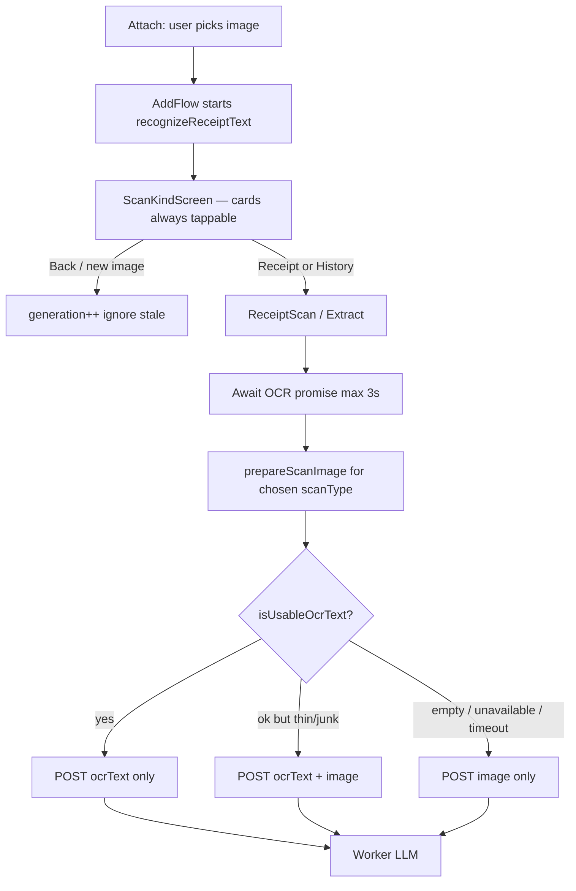

# ScanKind OCR prefetch + stricter usable gate

Date: 2026-09-15  
Status: implemented (from `/grill-me`)  
Related: [2026-09-15-scan-and-llm-performance-spec.md](./2026-09-15-scan-and-llm-performance-spec.md)

## Goal

Hide on-device ML Kit latency behind the “What did you scan?” choice, and stop shipping **garbage OCR as text-only** when a lone amount token fools today’s usable check.

No LLM call on ScanKind. The model still runs only after Receipt / History.

## Non-goals (v1)

- Soft-blocking or disabling the Receipt / History cards
- Prefetching JPEG resize on ScanKind (resize stays scanType-dependent)
- Speculative LLM for both kinds
- Prefetch on balance/snapshot paths, or on Receipt re-take / gallery re-pick
- Aborting native ML Kit mid-flight
- User-visible copy about usable / unusable / hybrid / vision
- Retraining or swapping the ML Kit script model (still Chinese recognizer)

## Locked decisions

| Topic | Decision |
| :--- | :--- |
| What runs on ScanKind | **OCR only** (`recognizeReceiptText(uri)`) |
| Resize | **After** kind is known, via existing `prepareScanImage(scanType)` |
| Tap before OCR finishes | **Navigate immediately**; next screen awaits the in-flight promise |
| Promise owner | **`AddFlow`**: `{ uri, promise, generation }` |
| Back / new pick | Bump `generation` (or clear); **ignore** stale resolves; do not abort ML Kit |
| Hang safety | Next screen `Promise.race(ocr, 3s)` → treat timeout as `{ status: 'unavailable' }` |
| Handoff shape | Prefetched **`OcrOutcome`**, not a finalized `inputKind` |
| Dual-path change | Accept optional precomputed OCR; **skip second ML Kit**; still resize + route |
| Unusable on ScanKind | **Silent**; later path becomes hybrid when text exists but fails the gate |
| Scope | Attach → ScanKind → Receipt / Extract only |
| Usable gate | Tighten in **this** change (not a follow-up) |

## Flow



## Ownership in `AddFlow`

On `onPicked(img)`:

1. Store `image = img`, `phase = 'kind'`.
2. `generation += 1` (or assign a new token).
3. Start `recognizeReceiptText(img.uri)`; keep `{ uri, promise, generation }`.

On Back from kind / new pick: bump generation (or clear the slot). When the old promise settles, drop the result if generation/uri no longer match.

Pass into Receipt / Extract:

- `image`
- `prefetchedOcr: Promise<OcrOutcome> | OcrOutcome | null` (resolved or still pending)
- `ocrGeneration` / uri for a final match check before use

`ScanKindScreen` does not own OCR state. Optional non-blocking hint (“Reading the image…”) is allowed; **do not** disable the two kind buttons.

## Dual-path API change

Extend `prepareDualPathScan` (or a thin wrapper used by `scanProxy` / `scanReceiptImage`) to accept:

```ts
prefetchedOcr?: OcrOutcome | Promise<OcrOutcome>
```

Behavior:

- If provided, **do not** call `recognizeReceiptText` again.
- Still run `prepareScanImage` for the chosen `scanType` (parallel with awaiting the promise if still pending).
- Apply the **new** `isUsableOcrText` to choose text / hybrid / vision.
- If the caller’s generation/uri no longer matches when the promise settles, treat as `unavailable` and continue with vision (should be rare if AddFlow clears on Back).

Quota / paywall checks stay where they are today (kind tap and/or scan submit) — unchanged by this spec.

## Stricter `isUsableOcrText`

Keep the cheap amount gate, then reject **hallucinated** transcripts that still contain a money-shaped token.

Usable only if **all** of:

1. `status === 'ok'`
2. `trim().length >= 20`
3. Has an amount-like token (unchanged):
   - `/\d+(?:[.,]\d{2})/`, or
   - currency-prefixed/suffixed whole number (`RM 25`, `$50`, `100 USD`, etc.)
4. **No hallucination signals** (new):
   - **Mixed-script token**: any whitespace-separated token matching both a Latin letter and a CJK/kana/hangul character (e.g. `け1北A、EL`). Real bilingual receipts keep scripts in separate tokens.
   - **Kana or Hangul present** anywhere: `/[\u3040-\u30ff\uac00-\ud7af]/`. Pip’s corpus is EN / ZH / MY; hiragana/katakana/hangul on a receipt is almost always the Chinese recognizer guessing on Latin print. **Hanzi alone is allowed** (Mala Kitchen etc.).

Failing (4) with non-empty text → **hybrid**, not vision. Only empty / unavailable / timeout → vision-only.

### Expected effect on the 5-image retest set

| Image | Today | After gate |
| :--- | :--- | :--- |
| `1000105419` (faded NS PLT) | usable (has `26.00`) → text-only | **unusable** (kana + mixed tokens) → hybrid |
| `1000105421` (Mala ZH) | usable | still usable (Hanzi + amounts; no kana/mixed Latin+CJK token) |
| `1000105423` (Econsave) | usable | still usable |
| `tngscreenshot` | usable | still usable |
| `pasted_image` (Swiss) | usable | still usable (`L.atte` / `9. 00` mess is Latin punctuation, not kana) |

Tune only with tests + these transcripts; do not add ML Kit confidence as the primary signal (Android-only / often 0).

## Entry points

| Path | Prefetch? |
| :--- | :--- |
| Attach → ScanKind → Receipt | Yes |
| Attach → ScanKind → Extract (transactions) | Yes |
| Receipt re-take / gallery after kind | No — existing dual-path |
| Balance / snapshot | No |
| Expo Go / web | OCR returns `unavailable` quickly; cards stay enabled; vision later |

## Tests

1. **`isUsableOcrText`**
   - Accepts clean EN/ZH receipts with amounts.
   - Rejects NS PLT–like garbage (`け1北A`, `マET`, lone `26.00`).
   - Rejects short / no-amount text.
   - Accepts `RM 25` / `$50` whole currency forms.

2. **`prepareDualPathScan` with prefetched OCR**
   - Does not call `recognizeReceiptText` when outcome supplied.
   - Usable → text-only body; junk-but-ok → hybrid; unavailable → vision.
   - Still resizes per `scanType`.

3. **`AddFlow` / handoff (unit or light integration)**
   - New pick bumps generation; stale OCR ignored.
   - 3s timeout surfaces as unavailable to the dual-path.

4. Keep existing scanProxy / worker hybrid tests green.

## Success criteria

- Choosing a kind no longer waits on OCR on ScanKind.
- Fast choosers still benefit when OCR finishes during the next screen’s first frames.
- Faded NS PLT–class OCR is **not** text-only.
- No double ML Kit on the ScanKind → submit path.
- No LLM / quota spend on ScanKind itself.

## Follow-ups (out of scope)

- Latin vs Chinese recognizer selection / dual-run merge
- Soft-block UX experiment if B feels racy in production
- Prefetch helper shared with Receipt re-pick
- Spec §7 accuracy harness (vision vs clamp vs OCR vs hybrid)
